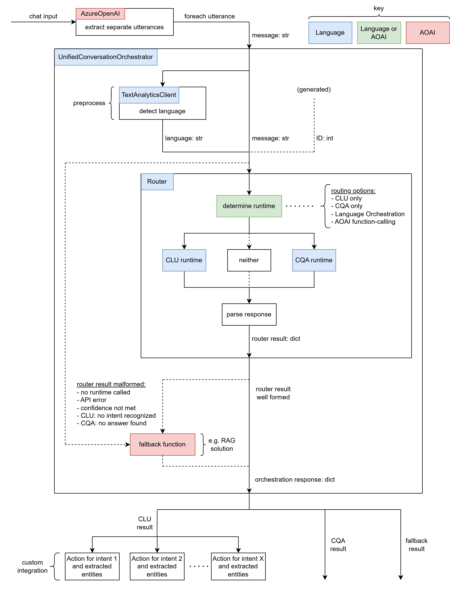

# Conversational Assistant

This project provides users with a code-first example on how to augment an existing `RAG` solution with Azure AI Language functionality. 

### Problem:
A typical `RAG` chat solution allows users to chat with an AI assistant and obtain grounded responses. This may be used to answer customer questions with contextual responses. However, `RAG` DSATs are hard to address. It is hard to debug or update grounding data to fix inaccurate "grounded" responses.

### Context:
Azure AI Language can help address these issues and expand functionality of `RAG` solutions. Azure AI Language already offers two services: [Conversational Language Understanding](https://learn.microsoft.com/en-us/azure/ai-services/language-service/conversational-language-understanding/overview) (`CLU`) and [Custom Question Answering](https://learn.microsoft.com/en-us/azure/ai-services/language-service/question-answering/overview) (`CQA`). `CLU` analyzes user input to extract intents and entities. `CQA` uses pre-defined question-answer pairs or a pre-configured knowledge base to answer user questions. 

### Solution:
This project includes a `UnifiedConversationOrchestrator` class that unifies both `CLU` and `CQA` functionality. Using a variety of different routing strategies, the orchestrator can intelligently route user input to either `CLU` or `CQA` runtimes. There is also fallback functionality when any of the following occurs: neither runtime is called, API call failed, confidence threshold not met, `CLU` did not recognize an intent, `CQA` failed to answer the question. This fallback functionality can be configured to be any function. In this user-story, fallback will be your original `RAG` chat solution. The orchestrator object takes a string message as input, and outputs a dictionary object containing information regarding what runtime was called, relevant outputs, was fallback called, etc.

### Benefits:
When combined with an existing `RAG` solution, adding a `UnifiedConversationOrchestrator` can help in the following ways:
-	Manual overrides of DSAT examples using `CQA`.
-	Extended chat functionality based on recognized intents/entities using `CLU`.
-	Consistent fallback to original chat functionality with `RAG`.

Further, users can provide their own business logic to call based on `CLU` results (e.g. with an `OrderStatus` intent and `OrderId` entity, users can include business logic to query their database to check the order status).

### Demo Experience:
The demo included with this project showcases the following chat experience:
-	User inputs chat dialog.
-	AOAI node preprocesses by extracting separate utterances from user input.
-	Orchestrator routes each utterance to either `CLU`, `CQA`, or fallback `RAG`.
-	If `CLU` was called, call extended business logic based on intent/entities.
-	Assistant summarizes response (what business action was performed, provide answer to question, provide grounded response).

This displays the "better-together" story when using Azure AI Language and Azure OpenAI.

### Example Data:
This project includes sample data to create project dependencies. Sample data is in the context of a fictionary outdoor product company: Contoso Outdoors.


### Prerequisites:
Users must have an [Azure AI Language resource](https://learn.microsoft.com/en-us/azure/ai-services/language-service/overview) and [Azure OpenAI resource](https://learn.microsoft.com/en-us/azure/ai-services/openai/how-to/create-resource?pivots=web-portal). 

1. Install [Azure CLI](https://learn.microsoft.com/en-us/cli/azure/).
2. Create/activate a new Python/Conda environment.
3. Install requirements: `pip install -r requirement.txt`
4. Copy the contents of `.env_schema.txt` into a new file name `.env`.
5. Follow the notebooks in `/setup/*.ipynb` to setup relevant project dependencies and populate your `.env` file.
6. Ensure all variables in `.env` are populated with values.

### Run the Demo:
```
az login
streamlit run demo.py
```

### Architecture:


### Routing Strategies:
- `BYPASS`: No routing. Only call fallback function.
- `CLU`: Route to CLU runtime only.
- `CQA`: Route to CQA runtime only.
- `ORCHESTRATION`: Route to either CQA or CLU runtime using an Azure AI Language [Orchestration](https://learn.microsoft.com/en-us/azure/ai-services/language-service/orchestration-workflow/overview) project to decide. 
- `FUNCTION_CALLING`: Route to either CLU or CQA runtime using AOAI GPT function-calling to decide.

In any case, the fallback function is called if routing "failed". `CLU` route is considered "failed" is confidence threshold is not met or no intent is recognized. `CQA` route is considered "failed" if confidence threhsold is not met or no answer is found. `ORCHESTRATION` and `FUNCTION_CALLING` routes depend on the return value of the runtime they call.

### Third-Party Dependencies:
This projects makes use of the following third-party OSS Python packages:
- [openai](https://pypi.org/project/openai/)
- [requests](https://pypi.org/project/requests/)
- [streamlit](https://pypi.org/project/streamlit/)
- [azure-search-documents](https://pypi.org/project/azure-search-documents/)
- [azure-ai-textanalytics](https://pypi.org/project/azure-ai-textanalytics/)
- [azure-identity](https://pypi.org/project/azure-identity/)
- [python-dotenv](https://pypi.org/project/python-dotenv/)

###  Trademarks: 
This project may contain trademarks or logos for projects, products, or services. Authorized use of Microsoft trademarks or logos is subject to and must follow [Microsoft’s Trademark & Brand Guidelines](https://www.microsoft.com/en-us/legal/intellectualproperty/trademarks/usage/general). Use of Microsoft trademarks or logos in modified versions of this project must not cause confusion or imply Microsoft sponsorship. Any use of third-party trademarks or logos are subject to those third-party’s policies.

### Data Collection:
The software may collect information about you and your use of the software and send it to Microsoft. Microsoft may use this information to provide services and improve our products and services. You may turn off the telemetry as described in the repository. There are also some features in the software that may enable you and Microsoft to collect data from users of your applications. If you use these features, you must comply with applicable law, including providing appropriate notices to users of your applications together with a copy of Microsoft’s privacy statement. Our privacy statement is located at https://go.microsoft.com/fwlink/?LinkID=824704. You can learn more about data collection and use in the help documentation and our privacy statement. Your use of the software operates as your consent to these practices.

**Note**: the only data collection in this project is marking the `User-Agent` header of all HTTP requests made from `language_http_utils.py`. To disable this, remove this reference (e.g. lines `9` and `123` in `language_http_utils.py`). 